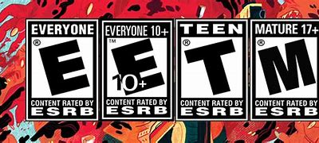
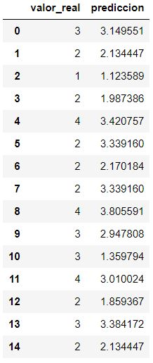

# :rocket:  Clasificación de videojuegos según su contenido   
**Curso de Ciencia de Datos, BEDU**   

Ernesto Román Moya

## :capital_abcd: Introducción

El proyecto consiste en que la computadora aprenda a clasificar un videojuego según su contenido.

Para esto debemos de entender que para este dataset obtenido de [Kaggle](https://www.kaggle.com/imohtn/video-games-rating-by-esrb) se observan 4 tipos de ratings a videojuegos que se enlistan a continuación.

* E = Apto para todos.
* ET = Apto para mayores de 10 años.
* T = Apto para mayores de 13 años.
* M = Apto para mayores de 17 años.

Los campos que contiene este dataset, a demás del rating del videojuego, son indicadores de tipo binario que muestran contenido en específico del videojuego, por ejemplo si el videojuego presenta uso de drogas el valor del campo será 1.

Para mayor referencia, este es el archivo en **Jupyter Notebook** que sirvió como herramienta para entrenar a la máquina.

[_**proyecto_final**_](Notebook/Final.ipynb)

### :dart: Objetivos y Tareas

* Utilizar Python con la herramienta de Jupyter Notebooks para realizar predicciones, clasificaciones y poder tomar una decisión.
* Con base en el rating de cada videojuego evaluar varios modelos predictivos para poder encontrar el que más se ajuste a las necesidades del proyecto.

## :ballot_box_with_check: Carga y limpieza de datos.

Para este proyecto se utilizo el dataset [Video_games_esrb_rating.csv](DATA/Video_games_esrb_rating.csv).

Para poder comenzar a usar este dataset se tuvo que cambiar el tipo de dato del rating del videojuego a un dato númerico utilizando la siguiente clasificación.

* E = 1
* M = 2
* ET = 3
* T = 4

La limpieza de datos se basó únicamente en buscar campos vacíos para eliminarlos y no entorpezcan el entrenamiento de la máquina, para suerte de nosotros, el dataset no contenía ningún dato vacío.

## :ballot_box_with_check: Clasificación.

* Datos de entrada: Se eligieron todos los campos del dataset a excepción del campo "Title" que contiene el nombre del videojuego, el campo "console" que es un indicador del tipo de consola compatible con el videojuego y obvio, el campo del rating del videojuego.
* Datos de salida: Solamente se tomó como dato de salida el rating del videojuego.
* Para el entrenamiento del modelo se tomaron 1000 registros dentro del dataset de manera aleatoria y un entrenamiento de 75% y pruebas de 25%.

## :ballot_box_with_check: Modelo.

**Matriz de Confusión**

La matriz de confusión nos permite observar si el desempeño de nuestro entrenamiento es óptimo. Para saber si el desempeño es óptimo, la matriz nos debe de arrojar la gran mayoría de resultados sobre la diagonal de la matriz, esto quiere decir que han caido dentro de los campos de verdaderos positivos.

**Árbol de Decisión**

Este modelo nos permite observar paso a paso la toma de decisiones de nuestro modelo, ya que va separando las muestras en verdadero y falso pasando por todas nuestras variables de entrenamiento. Aquí lo que nos indica que ya se ha tomado una desición es que ya no genera un verdadero o un falso, o simplemente por que el coeficiente de GINI ya está en 0. 

El coeficiente de GINI es un valor que esta entre 0 y 1 y nos dice que mientras este más cercano al 0 nuestro resultado es más perfecto.

**Regresión Lineal**

Este método nos sirve para poder encontrar algún tipo de correlación en nuestras variables.

El objetivo de este método es prededcir los resultados y acercarnos lo más posible a nuestros datos reales utilizando el entrenamiento que se le dió a la máquina.

## :ballot_box_with_check: Conclusiones

Con base en el dataset utilizado y el entrenamiento realizado con una muestra de 1000 registros aleatorios, el modelo de regresión lineal es el que más nos acerca a nuestros resultados reales, por lo que podemos concluir que si se decidiera utilzar este modelo para clasificar nuevos videojuegos, siempre y cuando se presenten los campos indicadores del contenido llenados de manera correcta.

A continuación se muestra el resultado obtenido con el modelo de regresión lineal.

## :ballot_box_with_check: Trabajo a futuro.

* Buscar más datos sobre videojuegos y que contengan todas los ratings existentes para poder entrenar el modelo y que al momento de que se ingrese un nuevo videoajugo sea capaz de reconocer a que rating corresponde sin problemas.
